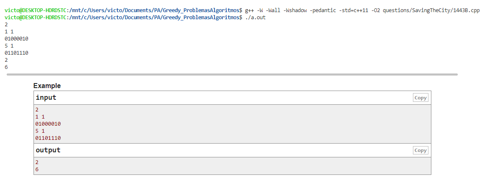
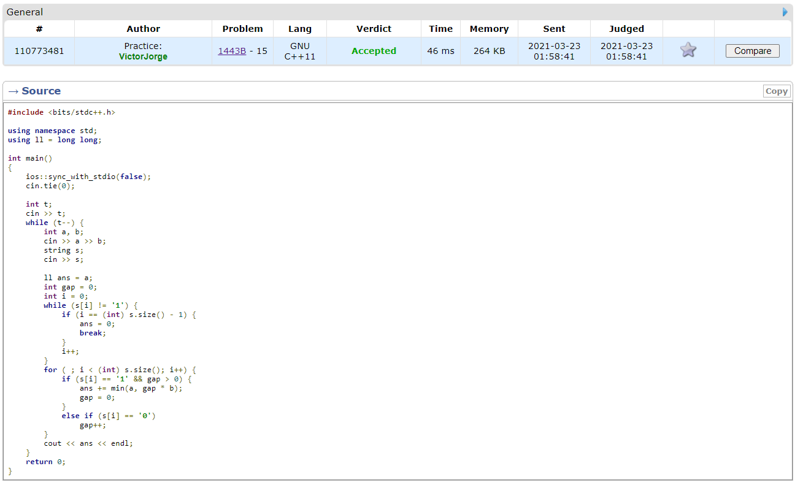

# ProblemasGulosos

**Número da Lista**: 3
**Conteúdo da Disciplina**: Greedy

## Alunos
|Matrícula | Aluno |
| -- | -- |
| 16/0049733  |  Felipe Borges de Souza Chaves |
| 18/0055241   |  Victor Jorge da Silva Gonçalves |

## Sobre 

Nosso projeto é a demonstração de várias soluções de problemas de programação usando
algoritmos gulosos. Para colher esses problemas filtramos em cada juiz online problemas
classifidos nesta técnica.

O objetivo do projeto é demonstrar diferentes contextos onde podemos aplicar algoritmos 
gulosos e também como pode ser dificil as vezes criamos esse tipo de solução.

## Problemas

Confira a solução de cada problema! Estão disponíveis os códigos e as explicações para cada um deles, bem como testá-los em sua máquina.

- [Add All](questions/addAll/README.md)
- [Appleman and Toastman](questions/ApplemanToastman/ApplemanToastman.md)
- [Dragons](questions/dragons/README.md)
- [Shopaholic](questions/shopaholic/README.md)
- [Saving the City](questions/SavingTheCity/SavingTheCity.md)

## Instalação 
**Linguagem**: C++<br>

Necessário compilador para linguagem C++ (recomendado o uso do GCC). Caso esteja executando em MacOS, atente-se às necessidades atreladas ao uso do cabeçalho:

```c++
#include <bits/stdc++.h>
```

## Screenshots

#### Testando o código localmente


#### Conferindo o veredito do juíz


## Outros 

Na pasta das questões temos todos os problemas resolvidos por pasta. Em cada 
pasta existe um código e também existe uma explicação do problema e solução em cada
arquivo README. No texto também temos o link para cada problema e uma comprovação de que 
o código foi submetido com sucesso, ou por meio de capturas de telas (quando o juíz não 
tem uma opção para gerar links para a submissão) ou a submissão em si.
