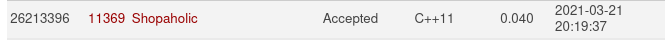

### Problema [link](https://onlinejudge.org/index.php?option=com_onlinejudge&Itemid=8&category=24&page=show_problem&problem=2354)

Neste problema existe uma loja que sempre da descontos para o 3ª item comprado.
Esse desconto é dado para o menor item da compra. Uma compradora percebeu que se
realiza-se várias compras de 3 items e não uma compra com todos poderia assim ganhar 
um desconto maior. O objetivo do problema aumentar ao máximo o desconto por esse método.

### Solução

Para maximizar a solução desse problemas precisamos maximizar cada compra individualmente, 
ou seja para compra temos que ter o maior desconto possível. Se compramos 3 items a b e c 
e organizamos a como o item de maior valor e c como o item de menor valor, podemos verificar que 
o valor final da compra é: a + b - c. O objetivo é ter o maior valor de c possível porem esse valor
é o menor entre os 3, podemos interpretar a + b como o valor a se pagar pelo desconto. Então para 
temos o maior custo beneficio vamos precisar minizar o valor de a e b. 

Visto a análise assima podemos assumir que precisamos fazer as compras dos items na ordem crescente.
Para termos o maior desconto possível.

O problema fornece o número de items que a compradora deseja comprar. 
Como nesse método compramos de 3 em 3 items não ganharemos descontos em compras de 
2 ou de 1 item. Dessa para otimizarmos essas compras podemos comprar os items mais baratos em 
compras de 2 ou 1 items pois nesse caso não podemos fazer nada para otimizar.

Dessa forma a solução final é:

Analisa se teremos compras de 2 ou 1 items. Para isso apenas faça (número de compras)%3. Isso dará
o número de items que não pode ser comprados em uma compra de 3.

Orderne os items de forma crescente. 

Some todos os items que serão o menor item em cada compra. Nesse caso serão todos os indices 
n%3 + iX3 com i entre 0 e n.

O resultado é o maior desconto possível.

**Submissão**

